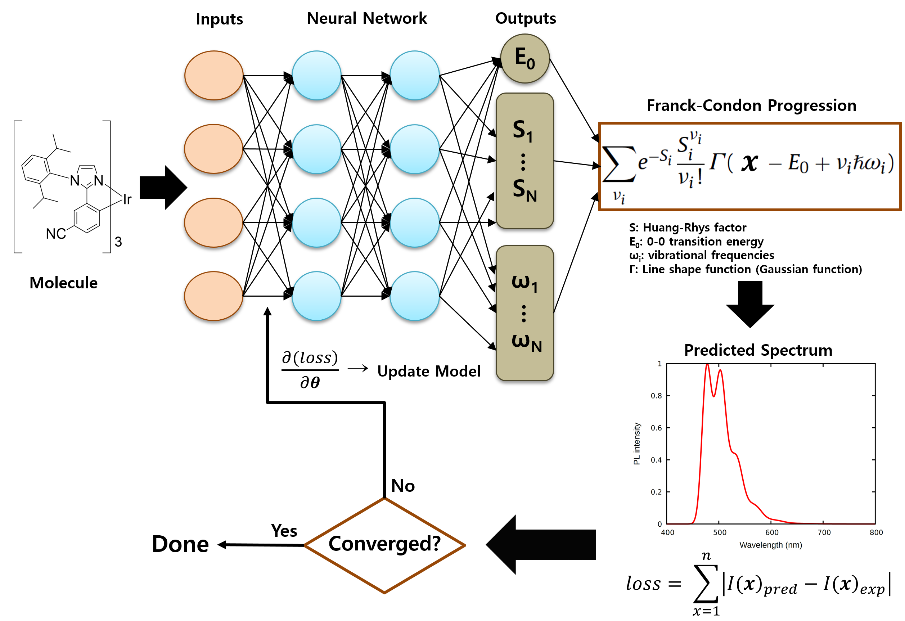

# Physics-Informed Machine Learning for Spectrum Prediction in Phosphorescent OLEDs
## Overview
Authors: Hasup Lee, Hyuntae Cho, Hwidong Na, Kuhwan Jeong, Sang Ha Park, Kisoo Kwon, MiYoung Jang, Eun Hyun Cho, Sanghyun Yoo, Hyun Koo, Changjin Oh, and Sun-Jae Lee

 

## Environments

- Install the dependencies

```shell
# Recommended environment: Python 3.12 and CUDA 12.4
python3 -m venv venv_spectrum
source venv_spectrum/bin/activate

# Install dependencies
pip install torch==2.5.1 torchvision==0.20.1 torchaudio==2.5.1 \
    --index-url https://download.pytorch.org/whl/cu124

pip install pyg_lib torch_scatter torch_sparse torch_cluster torch_spline_conv \
    -f https://data.pyg.org/whl/torch-2.5.1+cu124.html

pip install e3nn==0.5.1 torch_geometric==2.6.1 transformers==4.56.0 \
    ogb==1.3.6 ase==3.25.0 pytorch-lightning==2.5.1.post0 \
    rdkit==2025.3.5 einops==0.8.1 tensorboard==2.15.1 timm==1.0.19 lmdb==1.7.3 \
    "pydantic<2"
```

## Getting started

To train for spectrum prediction, just run:

```shell
python train.py --base-model {Geoformer|PaiNN|Equiformer} [--spectrum-type {Naive|GMM|FC} (default: FC)] [--batch-size <int> (default: 16)]
```
#### model 
 - Geoformer
 - PaiNN
 - Equiformer

#### spectrum_type 
 - Naive: Not consider Spectrum Loss.
 - GMM: Spectrum prediction based on Gaussian Mixture Model
 - FC: Spectrum prediction based on Franck-Condon progression

## Output

Spectrum prediction results are saved to "p_spec.csv"
 - p_spec.csv: id,Wavelength,Intensity (Normalized)

## Scripts

Python utilities for spectrum metrics are located in scripts/:
 - calc_SID.py: Spectral Information Divergence (SID), Spectral Information Similarity (SIS), Jensen-Shannon Divergence (JSD), Earth Mover's Distance (EMD)
 - calc_peak_fwhm.py: Peak position (Peak), Full Width at Half Maximum (FWHM), PL center, Full Width at Quarter Maximum (FWQM)
 - calc_ITPL_center.py: Intensity-Threshold PL center (IPTL center)
 - calc_FWXM.py: Generalized width at X% of maximum (FWXM) for Intensity-Threshold

## Contact

Please contact <A href="hasup.lee@samsung.com">Hasup Lee</A> for technical support.

## License

This project contains code under multiple licenses:

1. **excluding spectrum/**:
   - Based on [Geoformer](https://github.com/microsoft/AI2BMD/tree/Geoformer), [PaiNN](https://github.com/facebookresearch/fairchem/blob/977a80328f2be44649b414a9907a1d6ef2f81e95/src/fairchem/core/models/painn/painn.py), and [Equiformer](https://github.com/atomicarchitects/equiformer).
   - Licensed under the **MIT License**. See [LICENSE-MIT.txt](https://github.samsungds.net/hasup-lee/Spectrum/blob/main/LICENSE-MIT.txt) for the full terms.

2. **spectrum/**:
   - License under **CC BY-NC-SA 4.0**.
   - See [LICENSE-CCBYNCSA.txt](https://github.samsungds.net/hasup-lee/Spectrum/blob/main/LICENSE-CCBYNCSA.txt) for details and contact information.

## Acknowledgements
This work builds upon the following models:

  - **Geometric Transformer with Interatomic Positional Encoding**
    - Authors: Yusong Wang, Shaoning Li, Tong Wang, Bin Shao, Nanning Zheng, Tie-Yan Liu
    - Article: [https://neurips.cc/virtual/2023/poster/72577](https://neurips.cc/virtual/2023/poster/72577)
    - Github: [https://github.com/microsoft/AI2BMD/tree/Geoformer](https://github.com/microsoft/AI2BMD/tree/Geoformer)

  - **PaiNN: Polarizable Atom Interaction Neural Network**
    - Authors: Kristof T. Schütt, Oliver Unke, Michael Gastegger
    - Article: [https://arxiv.org/abs/2102.03150](https://arxiv.org/abs/2102.03150)
    - Original Github: [https://github.com/atomistic-machine-learning/schnetpack](https://github.com/atomistic-machine-learning/schnetpack)
    - Implementation adapted from: [facebookresearch/fairchem (commit 977a803, `src/fairchem/core/models/painn/painn.py`)](https://github.com/facebookresearch/fairchem/blob/977a80328f2be44649b414a9907a1d6ef2f81e95/src/fairchem/core/models/painn/painn.py)

  - **Equiformer: Equivariant Graph Attention Transformer for 3D Atomistic Graphs**
    - Authors: Yi-Lun Liao, Tess Smidt
    - Article: [https://arxiv.org/abs/2206.11990](https://arxiv.org/abs/2206.11990)
    - Github: [https://github.com/atomicarchitects/equiformer](https://github.com/atomicarchitects/equiformer)

